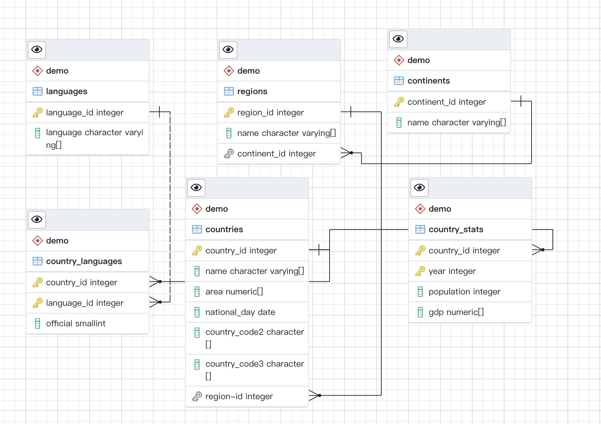
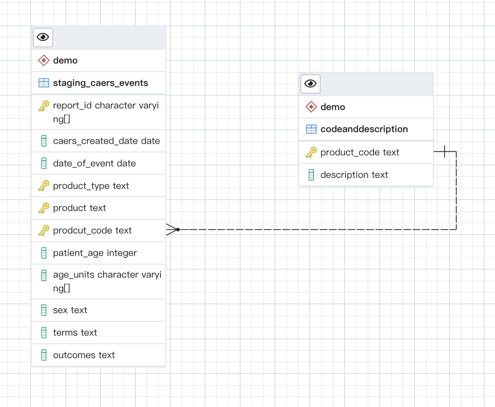

## Introduction
This is a school data homework aimed to use sql to inspect tables, create ER Diagrams and then do Normalization.

## Part 1: Create an ER Diagram by inspecting tables

1. table languages has a one to many relationship with table country_languages
   since: "country_languages_ibfk_2" FOREIGN KEY (language_id) REFERENCES languages(language_id)
2. table countries has a one to many relationship with table country_languages
   since: "country_languages_ibfk_1" FOREIGN KEY (country_id) REFERENCES countries(country_id)
3. table countries has a one to many relationship with table country_stats
   since TABLE "country_stats" CONSTRAINT "country_stats_ibfk_1" FOREIGN KEY (country_id) REFERENCES countries(country_id)
4. table regions has a one to many relationship with table countries_
   since TABLE "countries" CONSTRAINT "countries_ibfk_1" FOREIGN KEY (region_id) REFERENCES regions(region_id)
5. table continents has a one to many relationship with table regions
   since TABLE "regions" CONSTRAINT "regions_ibfk_1" FOREIGN KEY (continent_id) REFERENCES continents(continent_id)
## Part 2: Run Queries
Look at `part2_queries.sql`.  
## Part 3: Examine a data set and create a normalized data model to store the data

Since the primary key is composed of report_id, product_type, product, product_code. And all other columns are not 
depend on part of this primary key. But description is dependent on product_code. 
Therefore, we need two tables, one is composed of all columns from the original table, except for description, where 
report_id, product_type, product, product_code are primary key.
The other one is composed of description and product_code, where product_code is the primary key._
-- 1. this query tries to determine whether or not report id is unique	

It means that report_id is unique and could not be treated as primary key._

-- 2. this query tries to determine whether or not combined report_id with product is unique

It means that the combination of report_id and product is not unique and could not be treated as primary key._

-- 3. this query tries to determine whether or not combined report_id, product with product_type
-- is unique

It means that combination of report_id, product, and product_type_ is not unique and could not be treated as primary key._

-- 4. this query tries to determine whether or not combined report_id, product, product_type,
-- product_code is unique

It means that combination of report_id, product, product_type, and  product_code_ is unique and could be treated as primary key._
-- 5. this query tries to determine whether or not description is functionally dependent on product_code

From this query, we could know that the description is partially dependent on product_code. sometimes the product_code will appear twice just due
to the reason of spacing. 

-- 6. this query tries to determine whether or not caers_created_date is functionally dependent on date of event, or vice versa.

From this query, we could know that the date_of_event is not dependent on caers_created_date,
and the caers_created_date is not dependent on the date of event. 

